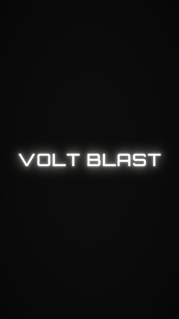
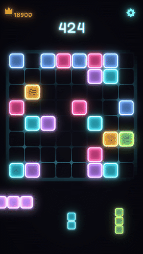
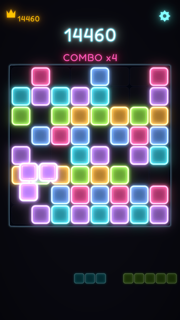
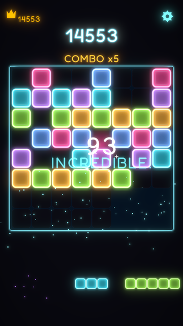
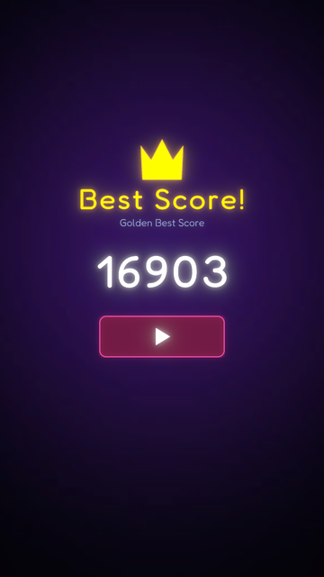

<div align="center">



# Volt Blast

**Neon Block Puzzle** — an 8×8 block puzzle for Android, built in Unity 6.



</div>

---

## The game

Drag pieces from the tray onto the board. Fill a row or a column and it clears. There is no
timer and no move limit — the run ends when none of the three pieces on offer fit anywhere,
so every placement is a bet on what you will be handed next.

| Playing | Clearing |
|:---:|:---:|
|  |  |

Pieces that no longer fit **dim**, so a dying board tells you it is dying. The frame warms
and pulses as the board fills past 62%, and lights up in proportion to the turn you just
pulled off.

<div align="center"></div>

---

## How it is built

The rules live in `Assets/Scripts/Core`, a plain C# assembly (`BlockBlast.Core`) that
references no Unity scene code. That is enforced by the assembly definition rather than by
discipline: the board, the placement tables, the scoring, the spawn selection and the
responsive layout cannot reach for a `MonoBehaviour` even by accident, which is what makes
them testable without opening the editor.

| | |
|---|---|
| **Board state** | One `ulong` bitboard, stride 8. Line detection is a mask compare; occupancy is a popcount. |
| **Placement** | Shapes are compiled once into per-anchor masks, so "can this fit here" is an AND. |
| **Spawn** | `TraySelector` samples candidate trays and picks by **softmax**, not argmax — argmax flattened the authored weights entirely and handed out the same piece forever. |
| **Layout** | The screen is split into HUD / board / tray **bands**, so overlap is impossible by construction rather than by tuning. Device cutouts are reserved before the bands are divided. |
| **Rendering** | One sprite atlas, one material, one draw path. The neon glow is bloom at runtime, not a blur baked into the sprites. |

### Tests

71 EditMode tests, mirrored by an offline harness that runs the same assertions through
Roslyn without launching Unity — 455 assertions in about a second, which is what makes it
worth running after every change.

The layout tests sweep **12 aspect ratios × 4 cutout configurations**, asserting that the
board fits, that the board never overlaps the tray, that the tray clears a gesture bar and
that the board clears a notch. Responsiveness is a property that is checked, not a thing
that is eyeballed on one phone.

```
Assets/Scripts/Core     rules, layout, scoring — no Unity scene types
Assets/Scripts          presentation: rendering, input, feel, audio
Assets/Tests/EditMode   71 tests over the core
```

---

## Building it

Open in **Unity 6000.3.10f1** with the Android module, then `Build → Android APK (Release)`.
`BuildRunner` re-asserts IL2CPP, ARM64 and portrait on every build and prints the whole
configuration first, so a setting nudged while debugging cannot quietly ship. There is a
`Build → Report Build Configuration` menu item that prints it without building.

Signing uses the debug keystore, which installs on a device but cannot be uploaded to Play.

---

## Credits and licences

- **Fonts** — [Orbitron](https://fonts.google.com/specimen/Orbitron) (wordmark) and
  [Fredoka](https://fonts.google.com/specimen/Fredoka) (interface), both SIL Open Font
  License; the licence files ship alongside them in `Assets/Fonts`.
- **Art** — generated from the scripts in this repository, not sourced.
- **Audio** — placeholder tones, generated. To be replaced.

Volt Blast is an original implementation. It is not affiliated with, endorsed by, or
derived from the code or assets of any other block puzzle game.
